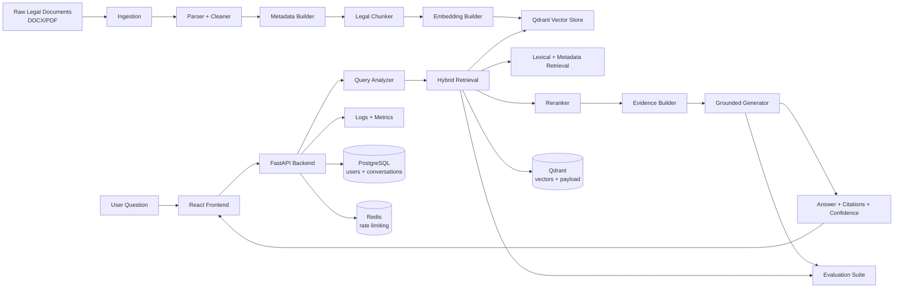

# Vietnamese Legal RAG Assistant

Vietnamese Legal RAG Assistant is an end-to-end Retrieval-Augmented Generation system for Vietnamese legal question answering. The current corpus focuses on the 2015 Civil Code and related legal documents, with a design that can expand to other legal domains without rewriting the core retrieval and generation pipeline.

The project demonstrates a practical Legal RAG stack: document ingestion, legal-aware chunking, metadata extraction, embedding, hybrid retrieval, reranking, grounded answer generation, citation control, evaluation, API hardening, and a React chat interface.

## Highlights

- Vietnamese legal question understanding with deterministic query analysis and retrieval-aware intent signals.
- Legal document processing for civil code, decrees, resolutions, and case law.
- Metadata-aware chunking with citations, source type, legal role, validity fields, and document relationships.
- Hybrid retrieval using metadata, lexical matching, vector retrieval, reranking, and fallback logic.
- Grounded generation with evidence IDs, citation validation, confidence signals, and hallucination controls.
- Human-review gating signals for low-confidence, weakly grounded, unverified, or fact-sensitive answers.
- Evaluation suite covering citation recall, answer terms, source type recall, grounding coverage, abstention, latency, and LLM-as-a-judge metrics.
- FastAPI backend with request IDs, rate limiting, request size limit, security headers, CORS config, Prometheus instrumentation, and API key support.
- React/Vite frontend with streaming chat UI, citations, feedback, and configurable API base URL.
- GitHub Actions quality gates for backend/RAG regression, encoding validation, frontend lint, and frontend build.

## Architecture



For a fuller architecture explanation, see [docs/architecture.md](docs/architecture.md).
For corpus update rules and source verification requirements, see [docs/corpus-governance.md](docs/corpus-governance.md).
For human review triggers, see [docs/human-review-policy.md](docs/human-review-policy.md).

## Repository Structure

```text
backend/
  app/                 FastAPI application layer
    api/               dependencies, middleware, v1 endpoints, request/response schemas
    core/              settings, logging, security helpers
    db/                SQLAlchemy base/session/init and ORM models
    repositories/      database access helpers
    services/          API-facing business logic and health checks
    factory.py         FastAPI app factory
    lifespan.py        startup/shutdown lifecycle
    server.py          ASGI entrypoint
  ingestion/           loaders, parsers, cleaners, chunkers, metadata, embeddings, indexing
  rag/
    retrieval/         query analyzer, retrievers, reranker, evidence builder
    generation/        prompt builder, rule-based/LLM generators, grounding checks
  evaluation/          datasets, evaluator, reporting, LLM judge
  scripts/             ingestion, validation, evaluation, indexing entrypoints
  tests/               regression tests for encoding, retrieval, generation, evaluation, API hardening
frontend/
  src/                 React chat app
  dist/                production build artifact
docs/
  architecture.md
  evaluation-summary.md
  cv-bullets.md
PROJECT_REPORT.md
```

## RAG Pipeline

1. **Data processing**
   - Reads raw legal documents from `backend/data/raw`.
   - Parses DOCX/PDF into structured JSON.
   - Cleans text and builds legal metadata.

2. **Chunking**
   - Uses document-type-aware chunkers.
   - Preserves article/citation metadata and legal role.

3. **Embedding and indexing**
   - Generates embeddings from chunk files.
   - Indexes embeddings into Qdrant with snapshot integrity checks.

4. **Retrieval**
   - Combines metadata retrieval, lexical retrieval, vector retrieval, reranking, and fallback.
   - Supports accent-insensitive Vietnamese matching.

5. **Generation**
   - Produces grounded legal answers with citations and evidence IDs.
   - Adds confidence signals, disclaimers, and hallucination guardrails.

6. **Evaluation**
   - Measures retrieval, generation, grounding, abstention, latency, and judge metrics.

## Backend Setup

```bash
cd backend
python -m venv .venv
.venv\Scripts\activate
pip install -r requirements.txt
copy .env.example .env
```

For Docker production-mode demo, configure `GROQ_API_KEY`, `SECRET_KEY`, `API_KEY`, `QDRANT_API_KEY`, `POSTGRES_PASSWORD`, and `ALLOWED_ORIGINS` in `.env`.

Dataset pháp lý, generated artifacts, local model cache và database storage được loại khỏi Git vì kích thước, dữ liệu nhạy cảm/bản quyền và khả năng thay đổi theo môi trường. Repo giữ lại source code, tests, evaluation datasets, source registry và tài liệu governance.

Run the API:

```bash
uvicorn app.server:app --host 0.0.0.0 --port 8000
```

Run the CLI:

```bash
python -m app.main "Điều 117 Bộ luật Dân sự quy định gì?"
python -m app.main "Điều 117 Bộ luật Dân sự quy định gì?" --retrieval-only
```

## Frontend Setup

```bash
cd frontend
npm install
copy .env.example .env
npm run dev
```

Default frontend API URL:

```text
VITE_API_BASE_URL=http://localhost:8000/api/v1
```

For the local production-mode demo, also set `VITE_API_KEY` to the backend `API_KEY`. This is suitable for a local portfolio demo only; a public deployment should place the API behind a gateway/BFF instead of exposing a shared key in browser code.

### Prepare local models

Install and start Ollama on the host, then pull the embedding and generator models:

```powershell
ollama pull bge-m3:latest
ollama pull llama3:latest
```

The Cross-Encoder model is intentionally not committed to Git. To enable it locally, download it into the ignored model directory:

```powershell
cd backend
..\.venv\Scripts\python.exe -c "from sentence_transformers import CrossEncoder; CrossEncoder('BAAI/bge-reranker-v2-m3').save('data/models/BAAI/bge-reranker-v2-m3')"
```

If the Cross-Encoder cache is unavailable, the system uses its deterministic hybrid-ranking fallback.

## Data Pipeline Commands

From `backend/`:

```bash
python -m scripts.ingest
python -m scripts.run_chunker
python -m scripts.run_embedding
python -m scripts.run_indexing --rebuild
```

Validation commands:

```bash
python scripts/validate_encoding.py . ../frontend --include-data
python scripts/validate_source_registry.py --path data/source_registry.json
python scripts/validate_chunks.py
python scripts/validate_embeddings.py
python scripts/validate_index.py
```

When Qdrant is running as a private Docker service, run the complete integrity check inside the app container:

```bash
docker compose exec app python -m scripts.validate_data_integrity
```

## Quality Checks

Backend:

```bash
cd backend
python -m pytest -q
python scripts/validate_encoding.py . ../frontend --include-data
```

Frontend:

```bash
cd frontend
npm run lint
npm run build
```

Current regression status:

- Backend full test suite: `117 passed`
- Indexed corpus: `3234 chunks`
- Encoding validation: passed
- Frontend lint: passed
- Frontend build: passed

## Evaluation

Run deterministic evaluation:

```bash
cd backend
python scripts/evaluate_system.py --dataset evaluation/datasets/legal_rag_eval_v2.json --no-llm-judge --json
```

Enable LLM-as-a-judge:

```bash
python scripts/evaluate_system.py --dataset evaluation/datasets/legal_rag_eval_v2.json --with-llm-judge
```

LLM judge is disabled by default through:

```text
LLM_JUDGE_ENABLED=false
```

See [docs/evaluation-summary.md](docs/evaluation-summary.md) for the current evaluation summary and limitations.

## Security and Production Hardening

The backend includes:

- API key enforcement in production.
- Production fail-fast validation for weak secrets, weak API keys, and wildcard CORS.
- Configurable CORS.
- Request body size limit.
- Redis token bucket rate limiting with in-memory fallback.
- Request IDs.
- Security headers.
- Redacted structured logging.
- Prometheus metrics endpoint.
- Health check endpoint.
- Separate liveness (`/live`) and readiness (`/ready`) probes for production orchestration.
- CI quality gates in `.github/workflows/quality-gates.yml`.
- Corpus governance validation through `backend/scripts/validate_source_registry.py`.
- Human-review flags exposed through answer confidence and surfaced in the frontend.

## Limitations

- Full end-to-end benchmark and some queries can be slow because the Cross-Encoder runs locally on CPU.
- The project is suitable for portfolio, demo, staging, or internal pilot usage, not direct legal advice in public production.
- Human review operations, monitoring dashboards, and full deployment gates still need to be added for production-grade use.

## Portfolio Value

This project showcases:

- Legal-domain RAG system design.
- Vietnamese NLP handling.
- Hybrid retrieval and metadata-aware search.
- Grounded generation and hallucination control.
- Evaluation-driven AI engineering.
- Backend/frontend integration and production hardening.

Suggested CV bullets are available in [docs/cv-bullets.md](docs/cv-bullets.md).
