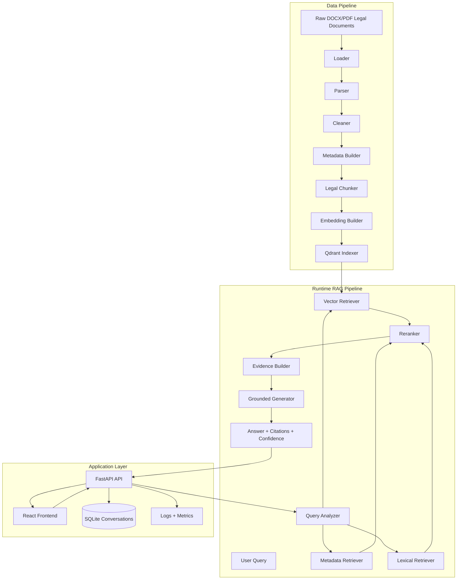

# Architecture

This document explains the system architecture of the Vietnamese Legal RAG Assistant.

## High-Level Flow



## Backend Modules

### `app/`

Contains the FastAPI application layer. It is organized into small HTTP, service, repository, core infrastructure, and database modules so API routes stay thin and domain code remains testable.

Key responsibilities:

- API endpoints for chat, streaming chat, conversations, and feedback.
- Request ID injection.
- Rate limiting.
- API key enforcement in production.
- Security headers.
- Health checks, separate liveness/readiness probes, and Prometheus metrics.

Current structure:

```text
app/
  api/
    deps.py
    middleware.py
    v1/
      router.py
      endpoints/
        auth.py
        chat.py
        conversations.py
        feedback.py
        health.py
      schemas/
        auth.py
        chat.py
  core/
    config.py
    logging.py
    security.py
  db/
    base.py
    config.py
    init.py
    session.py
    models/
      conversation.py
      document.py
      document_relationship.py
      user.py
  repositories/
    conversation_repository.py
    user_repository.py
  services/
    auth_service.py
    chat_service.py
    conversation_service.py
    feedback_service.py
    health_service.py
    security_policy.py
  factory.py
  lifespan.py
  server.py
```

HTTP endpoints receive and validate requests, services handle application behavior, repositories isolate SQLAlchemy queries, and `rag/retrieval` plus `rag/generation` remain the RAG domain runtime.

### `ingestion/`

Transforms raw legal documents into structured searchable artifacts.

Main stages:

- Load DOCX/PDF files.
- Parse legal structure.
- Clean text.
- Extract metadata.
- Validate official source and validity evidence through the source registry.
- Chunk by legal document structure.
- Generate embeddings.
- Index into Qdrant.

### `rag/retrieval/`

Handles query understanding and evidence retrieval.

Important components:

- Query analyzer.
- Metadata retriever.
- Lexical retriever.
- Vector retriever.
- Reranker.
- Evidence builder.
- Accent-insensitive Vietnamese matching utilities.

### `rag/generation/`

Creates final answers from retrieved evidence.

Important components:

- Prompt builder.
- Rule-based generator.
- Ollama/Groq generator options.
- Base generator validation.
- Citation and evidence grounding checks.
- Human-review gating for low-confidence, unverified, weakly grounded, or fact-sensitive answers.

### `evaluation/`

Measures RAG quality and regression behavior.

Metrics include:

- Request type match.
- Retrieval citation recall.
- Generation citation recall.
- Source type recall.
- Answer term coverage.
- Grounded citation precision.
- Grounding coverage.
- Abstention correctness.
- Latency budget.
- Optional LLM judge metrics.

## Design Choices

### Why Hybrid Retrieval?

Legal search needs both exact and semantic matching. A user may ask about "Điều 117", "the chap co hieu luc khi nao", or a long scenario. The system combines citation-aware matching, lexical search, vector retrieval, and reranking.

### Why Metadata-Rich Chunks?

Legal answer quality depends on source authority. Chunks carry citation, source type, legal role, validity metadata, and document relationships. This allows better ranking and better source display.

### Why Grounding Checks?

Legal hallucination is high risk. The generator validates citation IDs, weak support, and unsupported claims, then exposes confidence signals.

### Why Evaluation as a First-Class Module?

RAG quality can regress silently. The evaluation module provides repeatable benchmark cases and metrics that map to legal QA behavior.

## Deployment Notes

The project is currently strongest as a portfolio-grade or internal pilot system. Before public production usage, it should add:

- Full deployment gates beyond the current regression CI workflow.
- Monitoring dashboard and alerting.
- E2E tests.
- Operational staffing and escalation process for human-reviewed high-risk legal answers.
